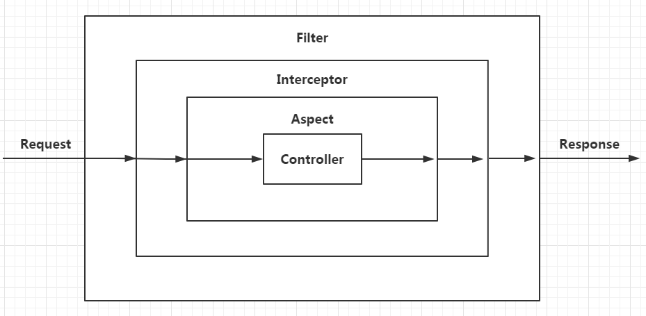

## 项目结构
当前工程结构，service层为业务逻辑处理，do层为dao的参数封装。
可考虑如下结构：do层下为service层，service关联数据库操作, do层为业务逻辑处理。

## Mybatis代码生成器
可考虑引入maven依赖org.mybatis.generator或使用idea插件MyBatisCodeHelperPro(参考：https://blog.csdn.net/HcJsJqJSSM/article/details/84348966)

## 代码检查
本地代码检查可考虑使用idea插件：SonarLint或CheckStyle-IDEA

## 请求拦截顺序
Req-->Filter-->Interceptor-->Aspect-->Controller


Filer是Java Web里的, 是获取不到Spring里的Controller信息; Interceptor、Aspect是和spring 相关的，可以获取到Controller的信息
注：在线绘制流程图等UML图, 推荐ProcessOn; 在线图片压缩推荐TinyPng

## 起服脚本
若不用python启动，则如下：
```
nohup java -cp ../dist/*:../lib/*:../resource org.springframework.boot.loader.JarLauncher >/dev/null 2>&1 &
```
debug:
```
nohup java -Xdebug -Xrunjdwp:transport=dt_socket,server=y,suspend=y,address=8096 -cp ../dist/*:../lib/*:../resource  org.springframework.boot.loader.JarLauncher >/dev/null 2>&1 &
```

## mysql创建新用户并授权远程连接等所有权限
root登录mysql后
```
create user 'usrName'@'%' identified by 'password';
grant all privileges on *.* to usrName@'%'identified by 'password';
```

## 若引入Redis作为session存储(EnableRedisHttpSession)
一般情况，cookie作用范围为域名根路径
1.未引入Redis前, 若不设置cookie作用范围, cookie默认作用范围同根路径context-path的设置，需设置如下
```
# 根路径
server.servlet.context-path=/monkey
# cookie作用范围
server.servlet.session.cookie.path=/
```
2.引入Redis, 则使用如下方式指定cookie作用范围
```
@Bean
CookieSerializer cookieSerializer() {
    DefaultCookieSerializer defaultCookieSerializer = new DefaultCookieSerializer();
    defaultCookieSerializer.setCookiePath("/");
    return defaultCookieSerializer;
}
```

## nginx 配置
```
# rewirte重定向导致post请求变为get, 解决方案为不使用rewrite或return, 使用proxy_pass

# location匹配规则如下
语法规则： location [=|~|~*|^~] /uri/ { … }
= 开头表示精确匹配

^~ 开头表示uri以某个常规字符串开头

~ 开头表示区分大小写的正则匹配

~* 开头表示不区分大小写的正则匹配

!~和!~*分别为区分大小写不匹配及不区分大小写不匹配的正则

/ 通用匹配，任何请求都会匹配到。

多个location匹配顺序为：
首先匹配 =，其次匹配^~, 其次是按文件中顺序的正则匹配，最后是交给 / 通用匹配。当有匹配成功时候，停止匹配，按当前匹配规则处理请求。
```
[nginx配置参考1](https://www.cnblogs.com/bluestorm/p/4574688.html)
[nginx配置参考2](http://outofmemory.cn/code-snippet/742/nginx-location-configuration-xiangxi-explain)
