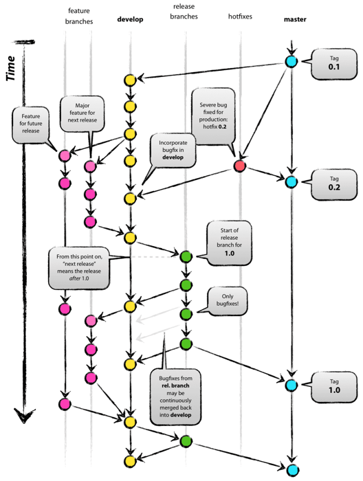

## MonkeyBean Laboratory
Small System, Just for Exercise
 
## 若严格Git工作流，分支说明
master: 稳定分支，上线后，若无问题, release merge to master 

release: 出包分支, 出包前, develop merge to release

develop: 开发主分支, 功能开发完毕后, feature merge to develop 

feature: 功能分支, 新需求开发前，由develop切出，命名规范为feature+功能名, 如feature_docker_multi

hotfix: 线上bug修复分支，由master分支切出，命名规范为hotfix加日期加标签，如hotfix_190101_01;
修复后直接出包，同时merge到master分支，并且cherry-pick到develop分支

